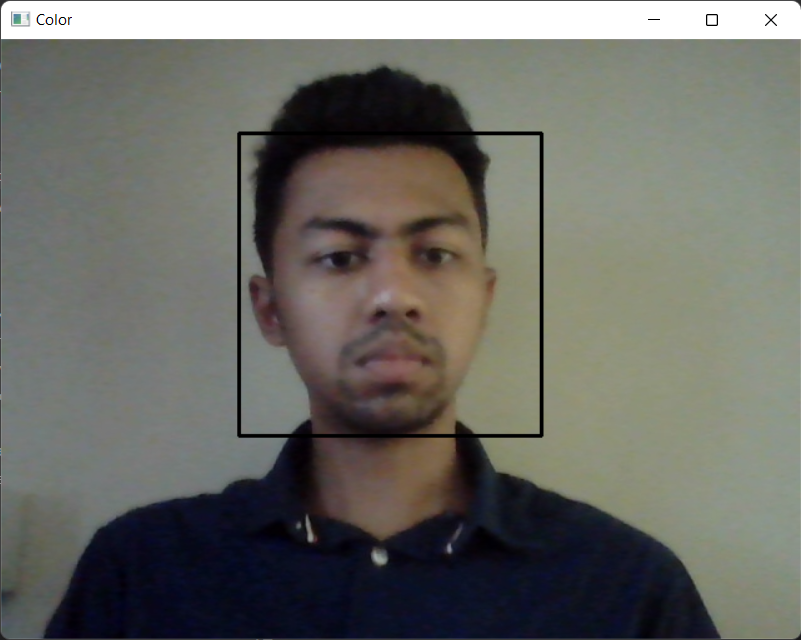
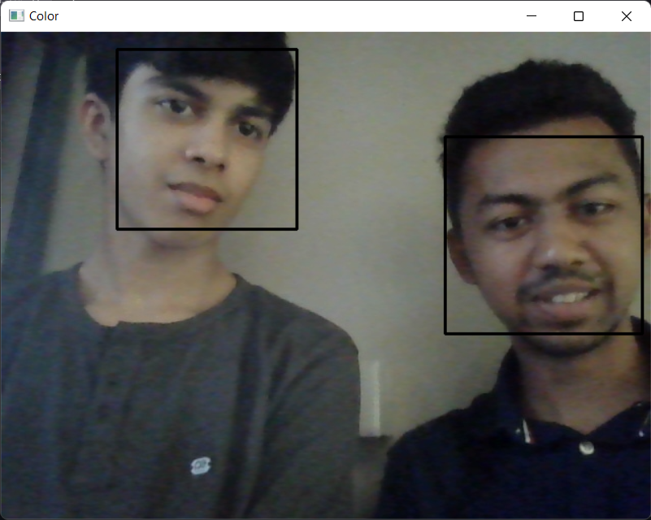

# Face-Detection
---
The method by which the programme detects the face is by using haar cascades its accuracy is dependent on the lighting condition of the subject in frame and the quality of the image being processed. The programme utilizes the opencv module to use the camera and the convert the image into black and white from color to ensure that it is able to meet the haar cascde requirements for input is able to process the image.
## File location
---

In order for the programme to call the haar cascade ensure that the location of the variable haar_cascade is set to the location where the haar cascade is downloaded.

<code>haar_cascade = cv.CascadeClassifier("C:/Users/...../haar_face.xml")</code>
## Programme in action
---
The programme is able to detect face with a proper lighting and background to high degree of accuracy.

  

It can also detect multiple faces with ease

  

